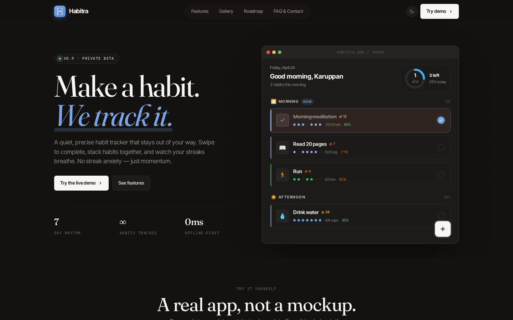
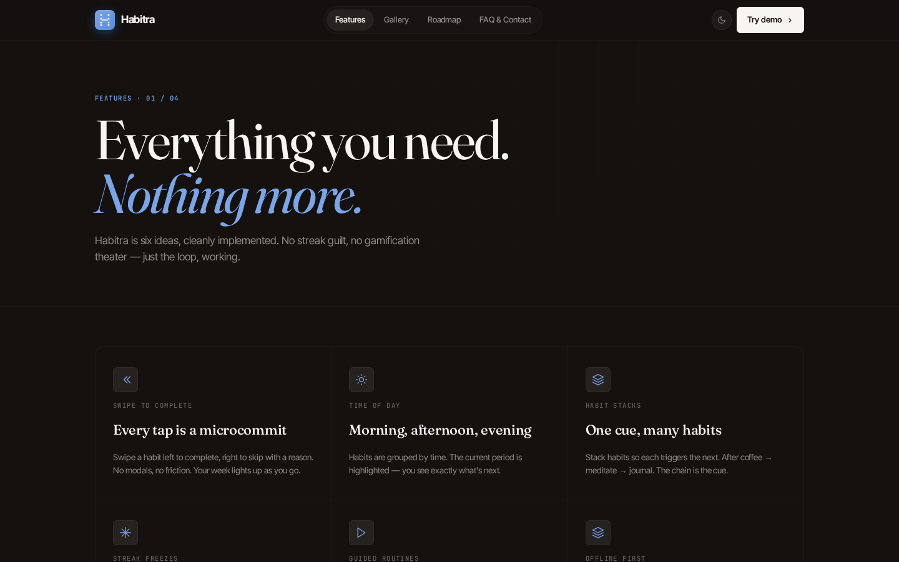
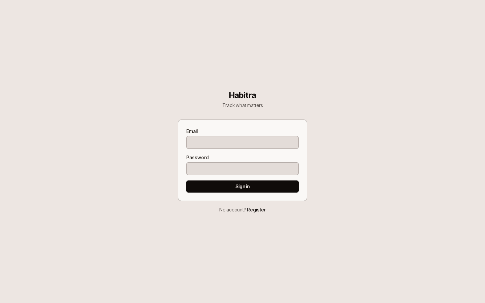
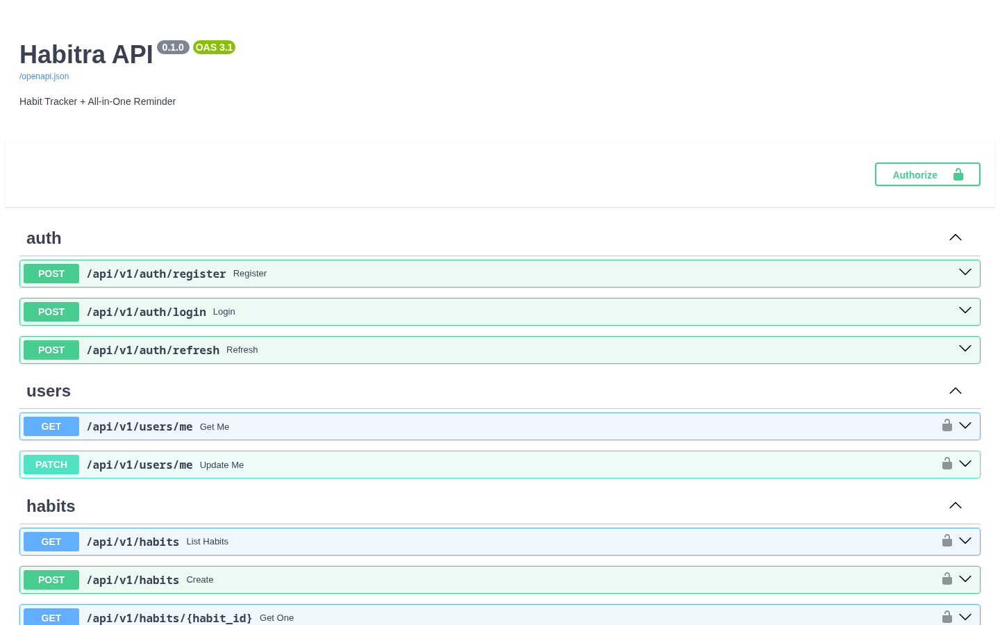

<div align="center">


# Habitra

**Make a habit. We track it.**

A quiet, precise habit tracker that stays out of your way. Swipe to complete, stack habits together, and watch your streaks breathe. No streak anxiety — just momentum.

[](https://app.habitra.iservelabs.in)
[](https://habitra-api.iservelabs.in/docs)
[](#)
[](https://github.com/karuppan-the-pentester/habitra-backend/actions)

</div>

---



---

## What is Habitra

Habitra is a multi-platform habit tracker built for people who want more than a streak counter. It combines flexible habit tracking, two-way Telegram notifications, guided routines, mood correlation analytics, and a full reminder engine — in one cohesive product.

- **Unlimited free habits** — no hard cap, no paywall for core tracking
- **Forgiving streaks** — freeze tokens, comeback framing, monthly trend score
- **Two-way Telegram** — tap a button in Telegram to log a habit, no app needed
- **Suppress-if-done** — reminders cancel automatically when you've already logged
- **Habit stacking** — chain habits so each one triggers the next
- **Guided routines** — step-by-step timers with pause, skip, and auto-complete

---

## Screenshots

| Branding Site | Features Page |
|:---:|:---:|
|  |  |

| App Login | API Docs |
|:---:|:---:|
|  |  |

---

## Repositories

| Repo | Description | Status |
|------|-------------|--------|
| [`habitra-backend`](https://github.com/karuppan-the-pentester/habitra-backend) | FastAPI + PostgreSQL + Celery — REST API, WebSockets, notification engine | ✅ Live |
| [`habitra-web`](https://github.com/karuppan-the-pentester/habitra-web) | Next.js 16 — web app at `app.habitra.iservelabs.in` | ✅ Live |
| [`Habitra`](https://github.com/karuppan-the-pentester/Habitra) | Branding site at `habitra.iservelabs.in` (this repo) | ✅ Live |
| `habitra-mobile` | React Native + Expo — iOS & Android | 🔜 Sprint 9 |
| `habitra-tui` | Python Textual — terminal UI | 🔜 Planned |
| `habitra-admin` | Internal admin dashboard | 🔜 Planned |

---

## Tech Stack

**Backend**
- Python 3.12 · FastAPI · PostgreSQL 16 · Redis 7
- SQLAlchemy 2.0 (async) · Alembic migrations
- Celery + Celery Beat — notification dispatcher
- JWT auth · bcrypt passwords

**Frontend**
- Next.js 16 (App Router, Turbopack) · Tailwind CSS 4
- Zustand · TanStack Query · React Hook Form + Zod
- OKLCH design system — dark-first, light theme

**Infrastructure**
- Hexahost VPS (ARM64, Ubuntu 24.04) · Docker Compose
- Cloudflare Tunnel (zero public ports) · CF WAF
- Vercel (frontend) · GitHub Pages (branding)
- GitHub Actions CI/CD → GHCR → auto-deploy

---

## Running Locally

### Backend

```bash
# Prerequisites: Docker, uv (pip install uv)
cd habitra-backend

# Start database and Redis
docker compose up db redis -d

# Copy and configure environment
cp .env.example .env

# Install dependencies and run migrations
uv sync
uv run alembic upgrade head

# Start the API
uv run uvicorn app.main:app --host 0.0.0.0 --port 13321 --reload
```

API: `http://localhost:13321` · Swagger docs: `http://localhost:13321/docs`

### Frontend

```bash
# Prerequisites: Node.js 20+, pnpm
cd habitra-web

# Install and start
pnpm install
pnpm dev --port 13322
```

App: `http://localhost:13322`

### Branding Site

```bash
cd habitra-branding
python3 -m http.server 13325
# Open http://localhost:13325
```

No build step — pure HTML/CSS with CDN React and Babel.

---

## Environment Variables

Copy `.env.example` to `.env` in `habitra-backend/` and fill in:

| Variable | Required | Description |
|----------|----------|-------------|
| `DATABASE_URL` | ✅ | PostgreSQL connection string |
| `REDIS_URL` | ✅ | Redis connection string |
| `JWT_SECRET_KEY` | ✅ | Random secret for signing JWTs |
| `APP_SECRET_KEY` | ✅ | App-level secret |
| `TELEGRAM_BOT_TOKEN` | Optional | From @BotFather — enables two-way Telegram |
| `TELEGRAM_WEBHOOK_SECRET` | Optional | `openssl rand -hex 32` |
| `VAPID_PRIVATE_KEY` | Optional | Web push — generate with `uv run python scripts/gen_vapid.py` |
| `VAPID_PUBLIC_KEY` | Optional | Web push public key |
| `ALLOWED_ORIGINS` | ✅ | Comma-separated frontend origins |

---

## API

Full interactive docs at [`habitra-api.iservelabs.in/docs`](https://habitra-api.iservelabs.in/docs).

Key endpoints:

```
POST /api/v1/auth/register     Create account
POST /api/v1/auth/login        Get JWT tokens
GET  /api/v1/habits            List habits with streaks + today data
POST /api/v1/habits/:id/logs   Log a value
GET  /api/v1/analytics/summary Consistency score + mood insights
WS   /ws/habits?token=         Real-time updates
GET  /health                   Health check
```

---

## Roadmap

| Sprint | Status | What |
|--------|--------|------|
| S1–S7 | ✅ Done | UI, heatmaps, streaks, notifications, onboarding, routines, analytics, mood |
| S8 | 🔜 Next | Social — accountability partners, friend activity feed |
| S9 | 🔜 Planned | Mobile app (React Native + Expo) |
| S10 | 🔜 Planned | AI features — Claude API, pattern detection, AI coach |

---

## Deployment

Production runs on a single Hexahost VPS (ARM64) with Docker Compose. Cloudflare Tunnel provides TLS and zero public ports. Frontend deploys to Vercel on every push to `main`. Full deployment docs in [`habitra-backend/DEPLOYMENT.md`](https://github.com/karuppan-the-pentester/habitra-backend).

---

<div align="center">

Made with focus. Built to last.

[habitra.iservelabs.in](https://habitra.iservelabs.in) · [Try the app](https://app.habitra.iservelabs.in)

</div>
